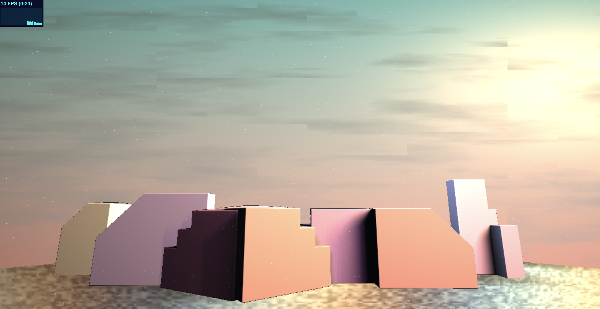
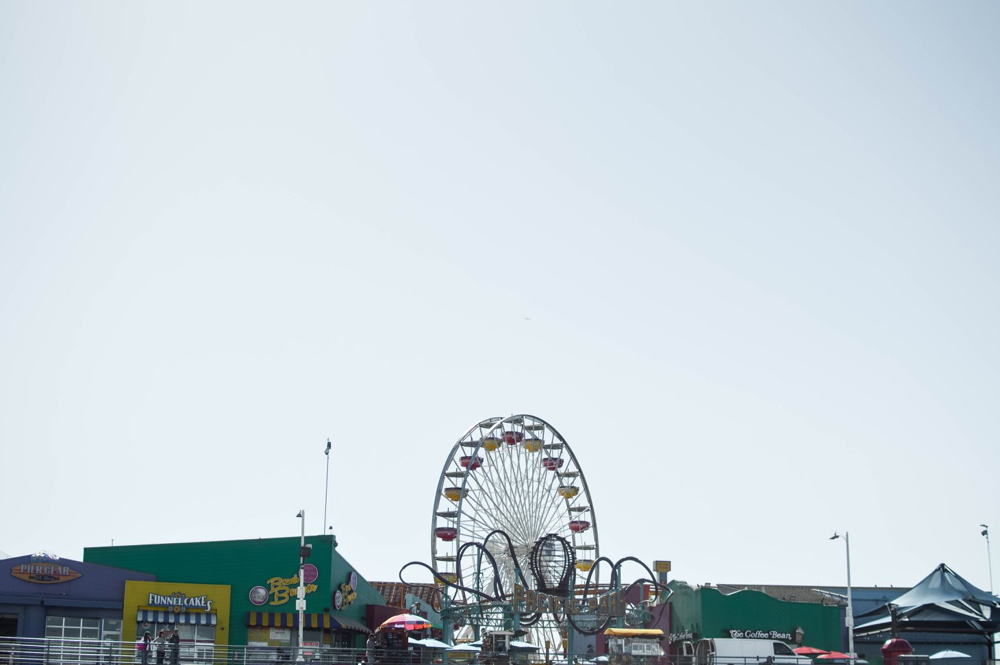

# CIS 566 Homework 3: Environment Setpiece

## Sources

I used all primitives and operations, as well as normal estimation functions from http://www.iquilezles.org/www/articles/distfunctions/distfunctions.htm. I also referred to this shader for its procedurally generated sky https://www.shadertoy.com/view/XlsXDB. I referred to IQ's distance fog generation http://iquilezles.org/www/articles/fog/fog.htm and Emily's 3 point lighting shaderToy.

## Demo

https://wentings.github.io/hw03-environment-setpiece/

This is an attempt at recreating a picture I took of the Santa Monica Pier (sans the ferris wheel and roller coaster).

## Techniques
I used animated the clouds and the sparkles in the scene using noise functions, and I also generated the texture of the ground with a noise function. I remapped the uv of the ground to a cosine generated color scheme, and used a 3 point lighting and SDF soft shadows to imitate the sunset lighting. I used smoothstep and mix in various ways to generate smooth color transtions. In addition, I used distance fog on the various distanced buildings, and a vignette post processing on both the sky and the overall look. 

